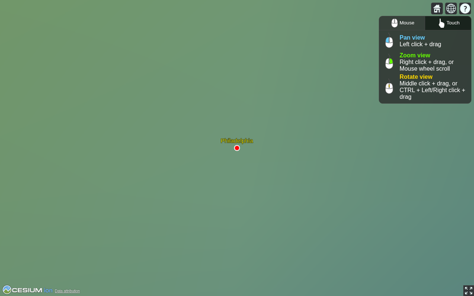
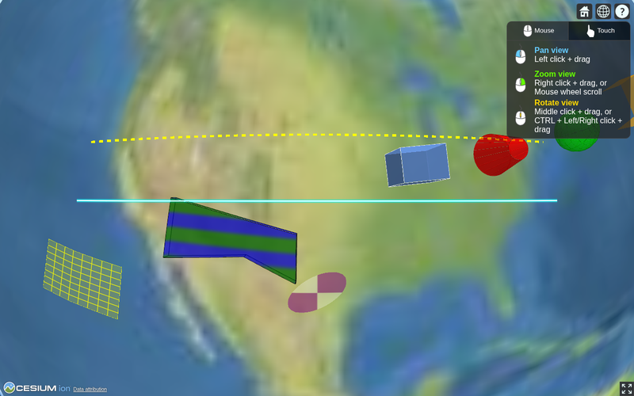
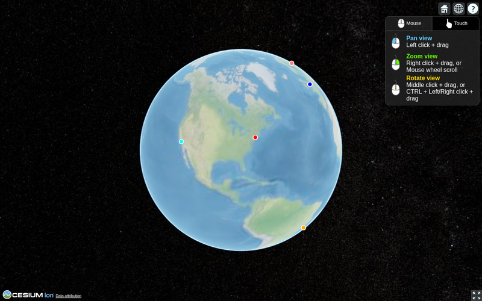
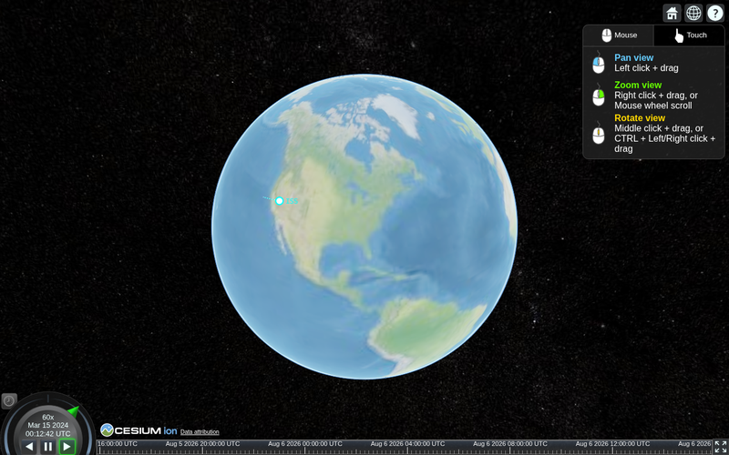
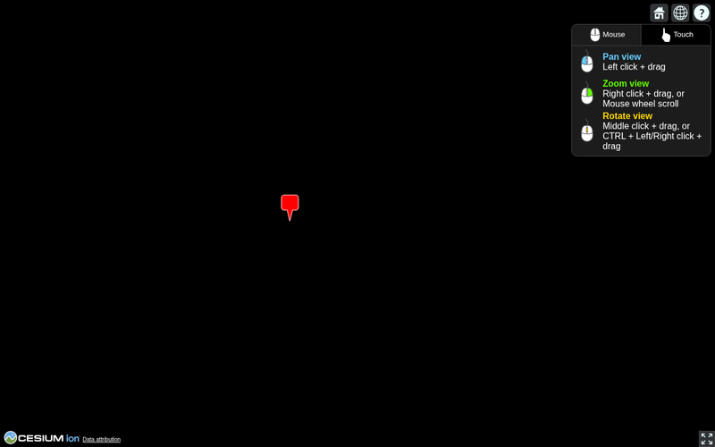
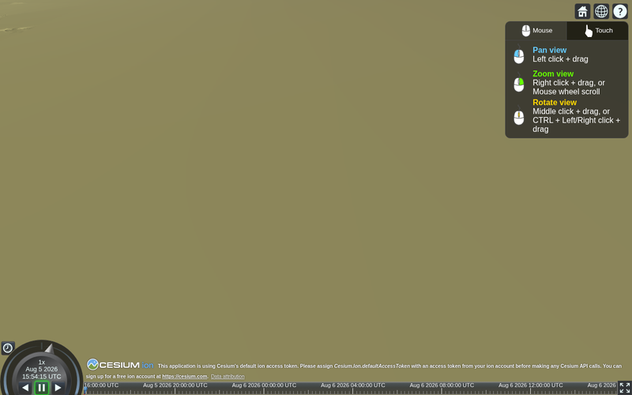
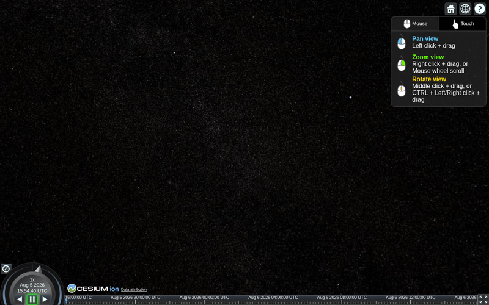
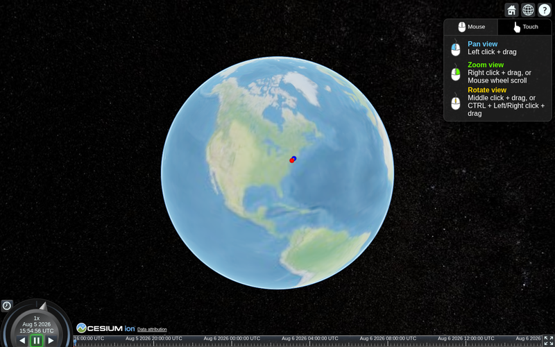
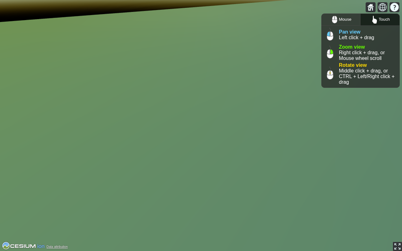
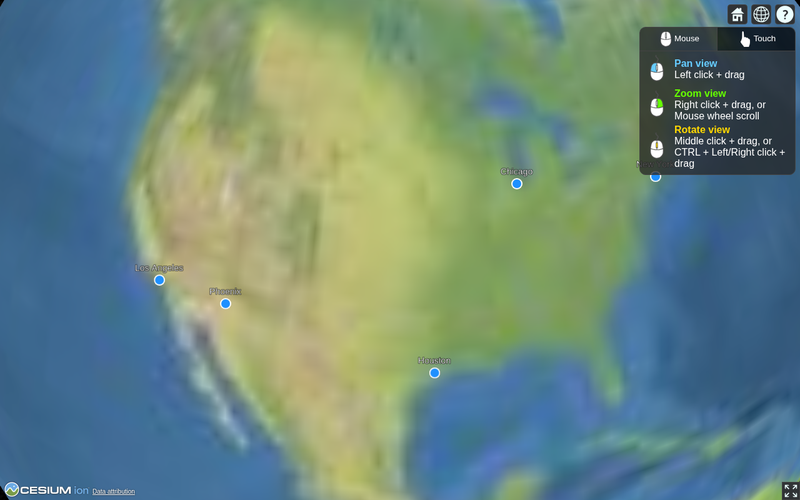

# Examples

_Reference. One page per runnable script in
[`examples/`](https://github.com/link2427/cesiumkit/tree/main/examples).
Every page contains the complete script — copy it, run it, change it._

For rendered screenshots of a curated subset, see the [Gallery](../gallery.md).

-   
    **01 · A point with a label** — the smallest useful scene.

-   
    **02 · Shapes and materials** — polygons, polylines, boxes, cylinders.

-   
    **03 · Multiple cities** — billboards and labels per city.

-   
    **04 · Time-dynamic satellite** — a sampled path with a clock.

-   
    **05 · GeoJSON, CZML, KML** — loading external data sources.

-   
    **06 · Terrain and imagery** — configuring the globe's base layer.

-   
    **07 · 3D models and tilesets** — glTF models and 3D Tiles.

-   
    **08 · CZML export** — entities for any CesiumJS application.

-   
    **09 · Camera controls** — fly_to, set_view, look_at.

-   
    **10 · Event handlers** — click interactivity with custom JavaScript.

-   :material-console-line:{ .lg .middle } **11 · Runtime control**

    ---

    Drive a running viewer from Python: set the clock, pick entities, and
    receive click callbacks.

    [:octicons-arrow-right-24: Runtime control example](11_runtime_control.md)

