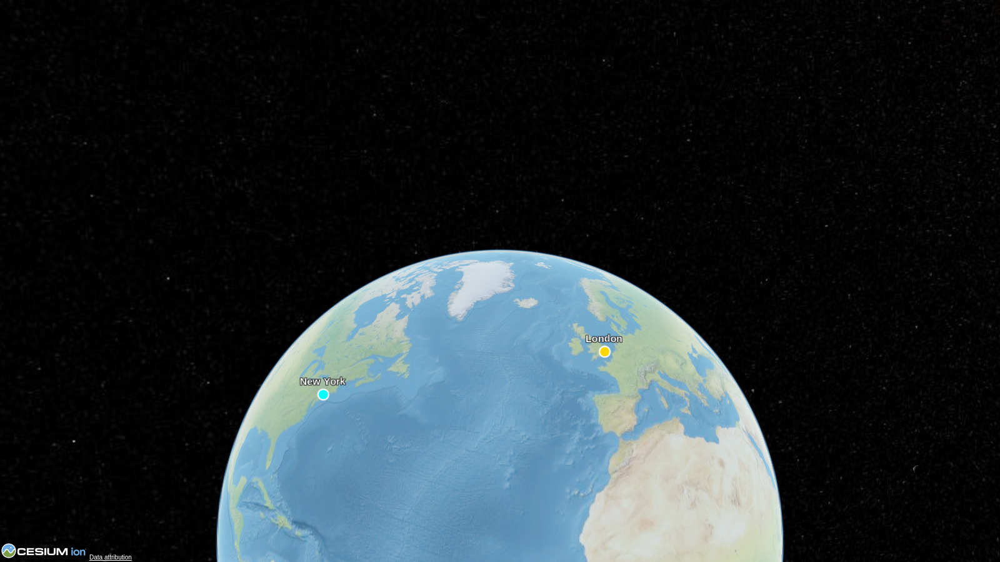
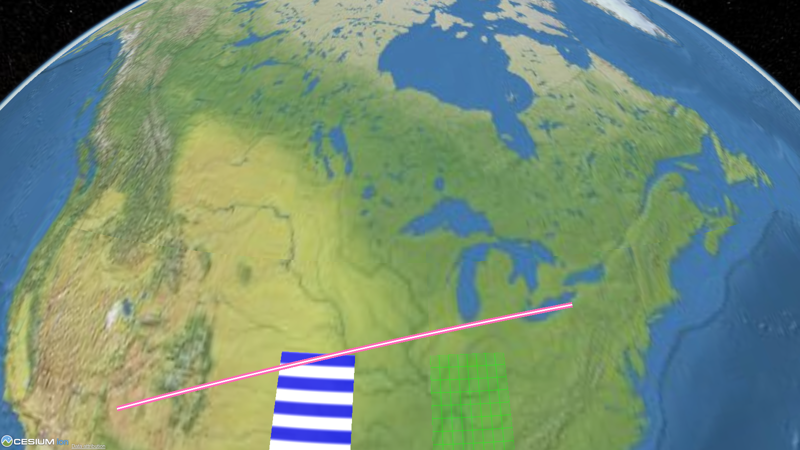
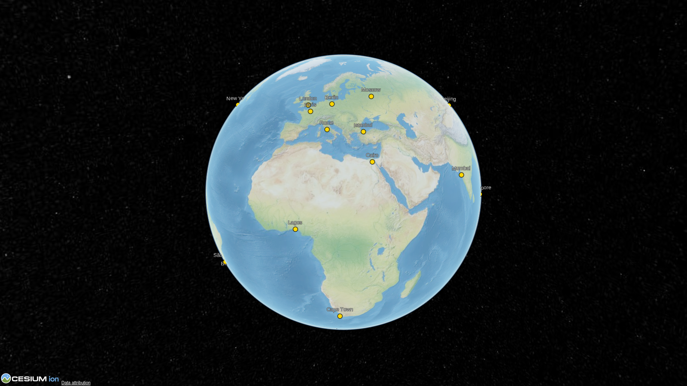
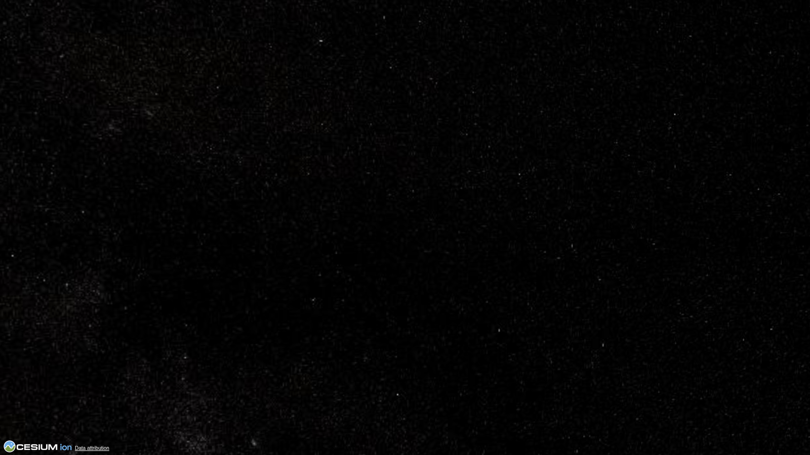
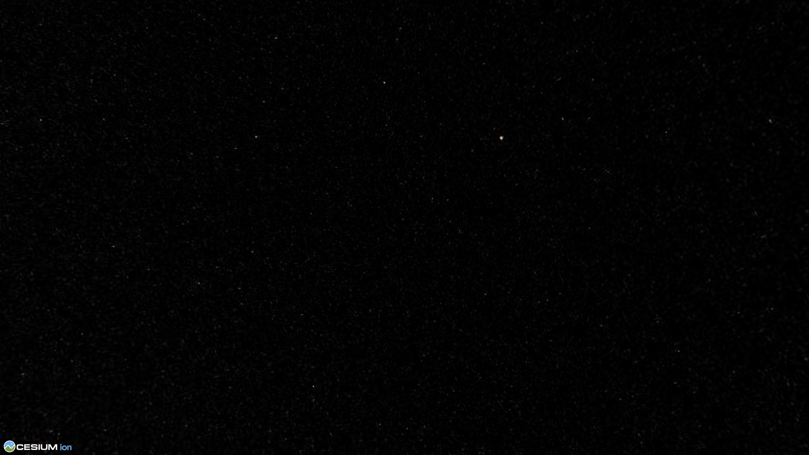

# Gallery

Screenshots generated from the runnable scripts in
[`scripts/gallery/`](https://github.com/link2427/cesiumkit/tree/main/scripts/gallery).
Each image is produced by importing the script, rendering its `viewer` to
HTML, and screenshotting it with playwright in CI.

-   __Globe Hero__

    

    Several labeled cities on a 3/4 view of the globe.
    [Source](https://github.com/link2427/cesiumkit/blob/main/scripts/gallery/01_globe_hero.py)

-   __Shapes & Materials__

    

    Stripe, grid, and glow materials on polygons and polylines.
    [Source](https://github.com/link2427/cesiumkit/blob/main/scripts/gallery/02_shapes.py)

-   __World Cities__

    

    20 major world cities as labeled points.
    [Source](https://github.com/link2427/cesiumkit/blob/main/scripts/gallery/03_cities.py)

-   __Flight Path__

    

    A glowing arc from New York to Paris.
    [Source](https://github.com/link2427/cesiumkit/blob/main/scripts/gallery/04_flight_path.py)

-   __GeoPandas Integration__

    

    One-line `viewer.add_geodataframe()` with per-feature color and extrusion.
    [Source](https://github.com/link2427/cesiumkit/blob/main/scripts/gallery/05_geopandas.py)

-   __Extruded Polygons__

    

    A grid of extruded polygon "buildings".
    [Source](https://github.com/link2427/cesiumkit/blob/main/scripts/gallery/06_polygon_3d.py)

